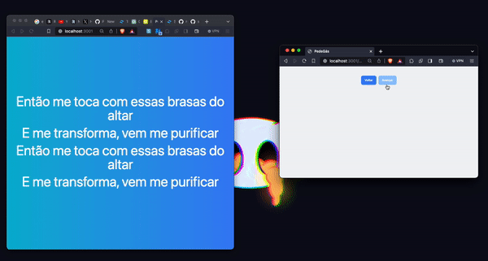

### Presentation server

This project is a simple presentation server that can be used to present a song lyrics.
It is written in Javascript and uses `Remix`, `tailwind`

- I'm using the Holyrics Idea, But I want to do something more pratical and simple.
- I want to plug it in my orange pi and keep it running all the time when I control everything from my phone.
- I want a better crawler for new songs, the holyrics one is not the best.
- I want to also implement the `Bible` as in Holyrics
- I want to store the songs locally using `prisma`
- I want to add the hability to play `videos` and `images` by just uploading it from my phone
- This one is also open source, so different of holyrics It's open
- As it is already web it can easily be used in multiple screens at the same time

## Demo

